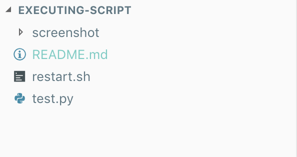

# Executing Linux Command with Shell Script

This topic is running some file and getting PID number from application progress and killed them if exist.

## Requirement
1. Command line support Linux command.
2. Python 2+.
3. Python time library

## Usage

In this project i'll introduce the folder tree :



restart.sh = Shell script to search the PID running from test.py to killed the process if the application running.
test.py = Python script to print text with lifetime loop.
screenshot = README.md image.

First of all you need change the restart.sh into execute file using : 
```bash
chmod +x restart.sh
```

After that running test.py with command : 
```python
python test.py
```

And then running the restart.py with command : 
```bash
./restart.sh
```

You can see the code will be killed on terminal : 

test.py
```bash
Your-Computer:Bash Executing yourusername$ python test.py 
lalalala
lalalala
Killed: 9
```
restart.sh
```bash
Your-Computer:Bash Executing yourusername$ ./restart.sh 
Program killed
```

## License
[MIT](https://choosealicense.com/licenses/mit/)# executing-script
